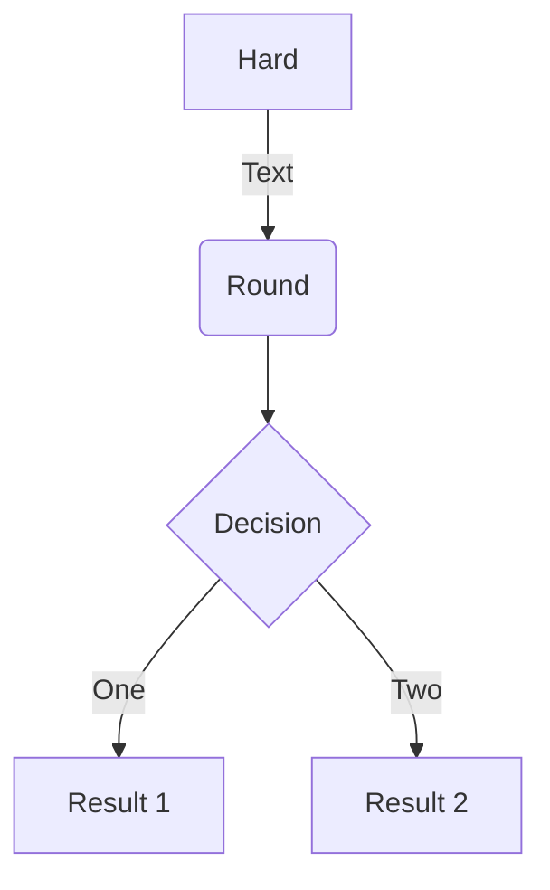
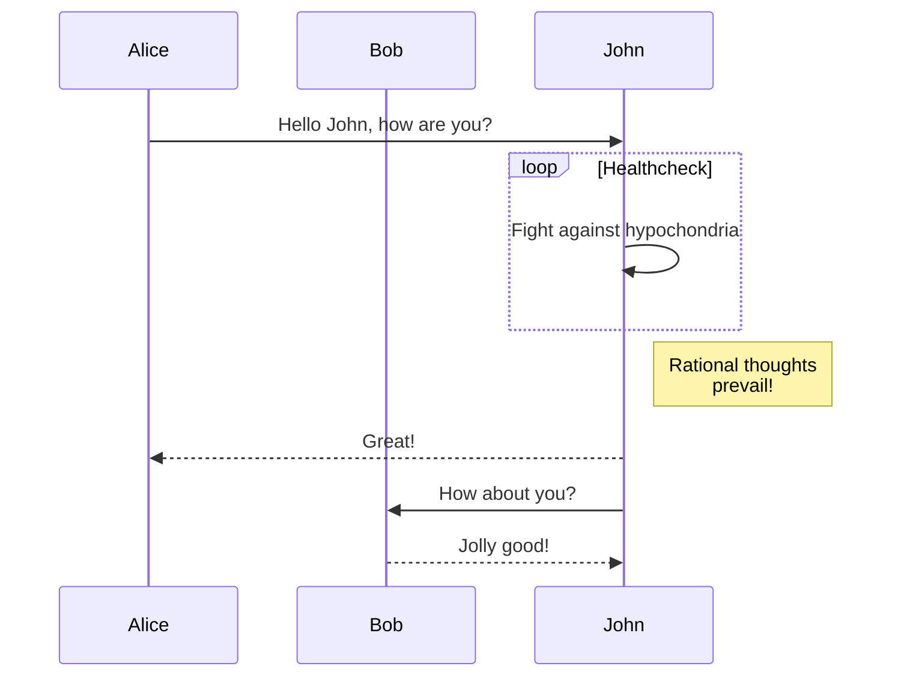

## Examples page

Here are some examples and templates. Check the source file for more information.

---

!!! abstract
    Lorem ipsum dolor sit amet, consectetur adipiscing elit. Nulla et euismod
    nulla. Curabitur feugiat, tortor non consequat finibus, justo purus auctor
    massa, nec semper lorem quam in massa.

!!! summary
    Lorem ipsum dolor sit amet, consectetur adipiscing elit. Nulla et euismod
    nulla. Curabitur feugiat, tortor non consequat finibus, justo purus auctor
    massa, nec semper lorem quam in massa.

!!! tldr
    Lorem ipsum dolor sit amet, consectetur adipiscing elit. Nulla et euismod
    nulla. Curabitur feugiat, tortor non consequat finibus, justo purus auctor
    massa, nec semper lorem quam in massa.

!!! info
    Lorem ipsum dolor sit amet, consectetur adipiscing elit. Nulla et euismod
    nulla. Curabitur feugiat, tortor non consequat finibus, justo purus auctor
    massa, nec semper lorem quam in massa.

!!! todo
    Lorem ipsum dolor sit amet, consectetur adipiscing elit. Nulla et euismod
    nulla. Curabitur feugiat, tortor non consequat finibus, justo purus auctor
    massa, nec semper lorem quam in massa.

!!! tip
    Lorem ipsum dolor sit amet, consectetur adipiscing elit. Nulla et euismod
    nulla. Curabitur feugiat, tortor non consequat finibus, justo purus auctor
    massa, nec semper lorem quam in massa.

!!! hint
    Lorem ipsum dolor sit amet, consectetur adipiscing elit. Nulla et euismod
    nulla. Curabitur feugiat, tortor non consequat finibus, justo purus auctor
    massa, nec semper lorem quam in massa.

!!! important
    Lorem ipsum dolor sit amet, consectetur adipiscing elit. Nulla et euismod
    nulla. Curabitur feugiat, tortor non consequat finibus, justo purus auctor
    massa, nec semper lorem quam in massa.

!!! success
    Lorem ipsum dolor sit amet, consectetur adipiscing elit. Nulla et euismod
    nulla. Curabitur feugiat, tortor non consequat finibus, justo purus auctor
    massa, nec semper lorem quam in massa.

!!! check
    Lorem ipsum dolor sit amet, consectetur adipiscing elit. Nulla et euismod
    nulla. Curabitur feugiat, tortor non consequat finibus, justo purus auctor
    massa, nec semper lorem quam in massa.

!!! done
    Lorem ipsum dolor sit amet, consectetur adipiscing elit. Nulla et euismod
    nulla. Curabitur feugiat, tortor non consequat finibus, justo purus auctor
    massa, nec semper lorem quam in massa.

!!! note
    Lorem ipsum dolor sit amet, consectetur adipiscing elit. Nulla et euismod
    nulla. Curabitur feugiat, tortor non consequat finibus, justo purus auctor
    massa, nec semper lorem quam in massa.

!!! warning
    Lorem ipsum dolor sit amet, consectetur adipiscing elit. Nulla et euismod
    nulla. Curabitur feugiat, tortor non consequat finibus, justo purus auctor
    massa, nec semper lorem quam in massa.

!!! example
    Lorem ipsum dolor sit amet, consectetur adipiscing elit. Nulla et euismod
    nulla. Curabitur feugiat, tortor non consequat finibus, justo purus auctor
    massa, nec semper lorem quam in massa.

!!! quote
    Lorem ipsum dolor sit amet, consectetur adipiscing elit. Nulla et euismod
    nulla. Curabitur feugiat, tortor non consequat finibus, justo purus auctor
    massa, nec semper lorem quam in massa.

!!! bug
    Lorem ipsum dolor sit amet, consectetur adipiscing elit. Nulla et euismod
    nulla. Curabitur feugiat, tortor non consequat finibus, justo purus auctor
    massa, nec semper lorem quam in massa.

!!! danger
    Lorem ipsum dolor sit amet, consectetur adipiscing elit. Nulla et euismod
    nulla. Curabitur feugiat, tortor non consequat finibus, justo purus auctor
    massa, nec semper lorem quam in massa.

!!! failure
    Lorem ipsum dolor sit amet, consectetur adipiscing elit. Nulla et euismod
    nulla. Curabitur feugiat, tortor non consequat finibus, justo purus auctor
    massa, nec semper lorem quam in massa.

---

Codeblock with language support

``` python
import tensorflow as tf
```

Codeblock with language support + Line numbers

``` python linenums="1"
""" Bubble sort """
def bubble_sort(items):
    for i in range(len(items)):
        for j in range(len(items) - 1 - i):
            if items[j] > items[j + 1]:
                items[j], items[j + 1] = items[j + 1], items[j]
```

----


=== "Bash"
    ``` bash
    #!/bin/bash

    echo "Hello world!"
    ```

=== "C"
    ``` c
    #include <stdio.h>

    int main(void) {
      printf("Hello world!\n");
      return 0;
    }
    ```

=== "C++"
    ``` c++
    #include <iostream>

    int main(void) {
      std::cout << "Hello world!" << std::endl;
      return 0;
    }
    ```

=== "C#"
    ``` c#
    using System;

    class Program {
      static void Main(string[] args) {
        Console.WriteLine("Hello world!");
      }
    }
    ```

---

Lorem ipsum[^1] dolor sit amet, consectetur adipiscing elit.[^2]

---

$$
\frac{n!}{k!(n-k)!} = \binom{n}{k}
$$

---

### Emoju

:smile: :heart: :thumbsup:


* :material-account-circle: – we can use Material Design icons
* :fontawesome-regular-laugh-wink: – we can also use FontAwesome icons
* :octicons-octoface: – that's not all, we can also use GitHub's Octicons

---

=== "Fruit List"
    - :apple: Apple
    - :banana: Banana
    - :kiwi: Kiwi

=== "Fruit Table"
    Fruit           | Color
    --------------- | -----
    :apple:  Apple  | Red
    :banana: Banana | Yellow
    :kiwi:   Kiwi   | Green


---

* [x] Lorem ipsum dolor sit amet, consectetur adipiscing elit
* [x] Nulla lobortis egestas semper
* [x] Curabitur elit nibh, euismod et ullamcorper at, iaculis feugiat est
* [ ] Vestibulum convallis sit amet nisi a tincidunt
    * [x] In hac habitasse platea dictumst
    * [x] In scelerisque nibh non dolor mollis congue sed et metus
    * [x] Sed egestas felis quis elit dapibus, ac aliquet turpis mattis
    * [ ] Praesent sed risus massa
* [ ] Aenean pretium efficitur erat, donec pharetra, ligula non scelerisque
* [ ] Nulla vel eros venenatis, imperdiet enim id, faucibus nisi

---

(tm)
(c)
(r)
c/o
+/-
-->
<--
<-->
=/=
1/4, etc.
1st 2nd etc.

---

[=0% "0%"]
[=5% "5%"]
[=25% "25%"]
[=45% "45%"]
[=65% "65%"]
[=85% "85%"]
[=100% "100%"]

---

[=85% "85%"]{: .candystripe}
[=100% "100%"]{: .candystripe .candystripe-animate}

[=0%]{: .thin}
[=5%]{: .thin}
[=25%]{: .thin}
[=45%]{: .thin}
[=65%]{: .thin}
[=85%]{: .thin}
[=100%]{: .thin}

---
## Caret

^^Insert me^^


H^2^0

text^a\ superscript^

---

## Critic

Here is some {--*incorrect*--} Markdown.  I am adding this{++ here++}.  Here is some more {--text
 that I am removing--}text.  And here is even more {++text that I 
 am ++}adding.{~~

~>  ~~}Paragraph was deleted and replaced with some spaces.{~~  ~>

~~}Spaces were removed and a paragraph was added.

And here is a comment on {==some
 text==}{>>This works quite well. I just wanted to comment on it.<<}. Substitutions {~~is~>are~~} great!

General block handling.

{--

* test remove
* test remove
* test remove
    * test remove
* test remove

--}

{++

* test add
* test add
* test add
    * test add
* test add

++}

---
### Details

???+ note "Open styled details"

    ??? danger "Nested details!"
        And more content again.


---

### Keys

++ctrl+alt+delete++

++ctrl+alt+"My Special Key"++

++cmd+alt+"&Uuml;"++


---

### Magic Links

- Just paste links directly in the document like this: https://google.com.
- Or even an email address: fake.email@email.com.


---

### Marks

==mark me==

==smart==mark==

---

### SuperFences

```
============================================================
T	Tp	Sp	D	Dp	S	D7	T
------------------------------------------------------------
A	F#m	Bm	E	C#m	D	E7	A
A#	Gm	Cm	F	Dm	D#	F7	A#
B♭	Gm	Cm	F	Dm	E♭m	F7	B♭
```

``` linenums="1"
import foo.bar
```







sequenceDiagram
    participant Alice
    participant Bob
    Alice->>John: Hello John, how are you?
    loop Healthcheck
        John->>John: Fight against hypochondria
    end
    Note right of John: Rational thoughts <br/>prevail!
    John-->>Alice: Great!
    John->>Bob: How about you?
    Bob-->>John: Jolly good!


### Tabs

=== "Tab 1"
    Markdown **content**.

    Multiple paragraphs.

=== "Tab 2"
    More Markdown **content**.

    - list item a
    - list item b


---


=== "Tab 1"
    Markdown **content**.

    Multiple paragraphs.

=== "Tab 2"
    More Markdown **content**.

    - list item a
    - list item b

===! "Tab A"
    Different tab set.

=== "Tab B"
    ```
    More content.
    ```


---

[^1]: Lorem ipsum dolor sit amet, consectetur adipiscing elit.
[^2]:
    Lorem ipsum dolor sit amet, consectetur adipiscing elit. Nulla et euismod
    nulla. Curabitur feugiat, tortor non consequat finibus, justo purus auctor
    massa, nec semper lorem quam in massa.
